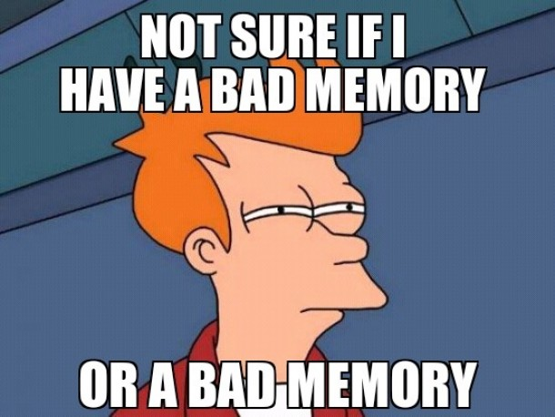

```{r setup, include=FALSE}
options(htmltools.dir.version = FALSE)
```

```{r xaringan-themer, include=FALSE}
library(xaringanthemer)
mono_accent(
  base_color = "#43418A",
  header_font_google = google_font("Josefin Sans"),
  text_font_google   = google_font("Montserrat", "300", "300i"),
  code_font_google   = google_font("Droid Mono")
)
```

```{r, echo = FALSE}

myglossary <- list()
glossary <- function(term, display = NULL, shortdef = "", link = TRUE) {
  lcterm <- gsub(" ", "-", tolower(term), fixed = TRUE)
  if (is.null(display)) display <- term
  first_letter <- substr(lcterm, 1, 1)
  url <- paste0("https://psyteachr.github.io/glossary/", first_letter)
  if (shortdef == "") {
    hash <- paste0("#", lcterm, " dfn")
    shortdef <- tryCatch(xml2::read_html(url) %>% 
                           rvest::html_node(hash) %>%
                           rvest::html_text() %>%
                           gsub("\'", "&#39;", .),
                         error = function(e) { "" })
  }
  
  ## add to global glossary for this book
  myglossary[lcterm] <<- shortdef
  
  if (link) {
    paste0("<a class='glossary' target='_blank' title='", shortdef, 
         "' href='", url, "#", lcterm, "'>", display, "</a>")
  } else {
    paste0("<a class='glossary' title='", shortdef, "'>", display, "</a>")
  }
}
```

## Learning Objectives

1. Understand the components of the [RStudio IDE](#rstudio_ide)
2. Type commands into the [console](#console)
3. Understand [function syntax](#function_syx)
4. Install a [package](#install-package)
5. [Organise a project](#projects)
6. Appropriately [structure an R script or RMarkdown file](#structure)
7. Create and compile an [Rmarkdown document](#rmarkdown)

---

## Resources

* [Chapter 1: Introduction](http://r4ds.had.co.nz/introduction.html) in *R for Data Science*

* [RStudio IDE Cheatsheet](https://github.com/rstudio/cheatsheets/raw/master/rstudio-ide.pdf)

* [Introduction to R Markdown](https://rmarkdown.rstudio.com/lesson-1.html)

* [R Markdown Cheatsheet](https://www.rstudio.com/wp-content/uploads/2016/03/rmarkdown-cheatsheet-2.0.pdf)

* [R Markdown Reference](https://www.rstudio.com/wp-content/uploads/2015/03/rmarkdown-reference.pdf)

---

## What is R?

```{r, echo = F, out.width = "10%"}
knitr::include_graphics("images/01/new_R_logo.png", dpi = NA)
```

R is a programming environment for data processing and statistical analysis. It is well suited to **reproducible research**. 

--

R allows you to write scripts that combine data files, clean data, and run analyses. There are many other ways to do this, but R has certain important advantages:

--

1. R is free
2. It has powerful plotting and graphics capabilities
3. Is well suited to interactive, trial and error data analysis 
5. Has an active and vibrant community especially in the life sciences  
6. Is welcoming to newcomers and underrepresented groups commonly marginalized in coding generally.

???

This refers to being able to document and reproduce all of the steps between raw data and results.

---

### The Base R Console 

If you open up the application called R, you will see an "R Console" window that looks something like this.

```{r img-repl, echo=FALSE, fig.cap="The R Console window."}

``` 

You can close R and never open it again. We'll be working entirely in RStudio in this class.

```{block, type="warning"}
ALWAYS REMEMBER: Launch R though the RStudio IDE

Launch  (RStudio.app), not  (R.app).
```

---

### RStudio 

[RStudio](http://www.rstudio.com) is an Integrated Development Environment (IDE). This is a program that serves as a text editor, file manager, and provides many functions to help you read and write R code.

```{r img-rstudio, echo=FALSE, fig.cap="The RStudio IDE", out.width= "50%"}
knitr::include_graphics("images/01/rstudio.png")
``` 

---

### RStudio

RStudio is arranged with four window `r glossary("panes")`. 

By default, the upper left pane is the **source pane**, where you view and edit source code from files. 

The bottom left pane is usually the **console pane**, where you can type in commands and view output messages. 

The right panes have several different tabs that show you information about your code. 

You can change the location of panes and what tabs are shown under **`Preferences > Pane Layout`**.

---

### Configure RStudio

You should learn how to develop **reproducible scripts**. 

This means scripts that completely and transparently perform some analysis from start to finish in a way that yields the same result for different people using the same software on different computers. 

--

```{r, echo = F, out.width = "50%", fig.align = 'center'}

```

---

## Reproducibility

When you do things reproducibly, others can understand and check your work. 
+ The most important person who will benefit from a reproducible script is your __future self__. 

--

Two Rstudio tweaks to maximize reproducibility:
1. Go to the preferences/settings menu, and uncheck the box that says **`Restore .RData into workspace at startup`**
1. Set Save workspace on exit to **`Never`**

```{r img-repro, echo=FALSE, out.width='50%', fig.cap="Alter these settings for increased reproducibility."}

```

???

If you keep things around in your workspace, things will get messy, and unexpected things will happen. You should always start with a clear workspace. This also means that you never want to save your workspace when you exit, so set this to **`Never`**. The only thing you want to save are your scripts.

---

## Getting Started

### Console commands 

We are first going to learn about how to interact with the console. You can consider the console a kind of **sandbox** where you can try out lines of code and adapt them. Then you can copy them back into the script editor.

--

You will often type into the script editor window (either into an R script or an R Markdown file) and then send the commands to the console by placing the cursor on the line and holding down the Ctrl key while you press Enter. 

--

The Ctrl+Enter key sequence sends the command in the script to the console.

--

```{r, echo = F, out.width = "40%", fig.align = 'center'}
knitr::include_graphics("images/memes/typos.jpg", dpi = NA)
```

---

One simple way to learn about the R console is to use it as a calculator. Enter the lines of code below and see if your results match. Be prepared to make lots of typos (at first).

```{r calc1}
1 + 1
```

---

The R console remembers a history of the commands you typed in the past. Use the up and down arrow keys on your keyboard to scroll backwards and forwards through your history. It's a lot faster than re-typing.

```{r calc2}
1 + 1 + 3
```

You can break up math expressions over multiple lines; R waits for a complete expression before processing it.

```{r calc3}
## here comes a long expression
## let's break it over multiple lines
1 + 2 + 3 + 4 + 5 + 6 +
    7 + 8 + 9 +
    10
```

---

Text inside quotes is called a `r glossary("string")`.

```{r char-demo}
"Good afternoon"
```

---

You can break up text over multiple lines; R waits for a close quote before processing it. If you want to include a double quote inside this quoted string, `r glossary("escape")` it with a backslash.

```{r multiline-char-demo}
africa <- "I hear the drums echoing tonight  
But she hears only whispers of some quiet conversation  
She's coming in, 12:30 flight  
The moonlit wings reflect the stars that guide me towards salvation  
I stopped an old man along the way  
Hoping to find some old forgotten words or ancient melodies  
He turned to me as if to say, \"Hurry boy, it's waiting there for you\"

- Toto"

cat(africa) # cat() prints the string
```

---

### Variables 

Often you want to store the result of some computation for later use.  You can store it in a `r glossary("variable")`. A variable in R:

* contains only letters, numbers, periods, and underscores
* starts with a letter or a full stop and a letter
* distinguishes uppercase and lowercase letters (`rickastley` is not the same as `RickAstley`)

--

.pull-left[The following are valid and different variables:

* songdata
* SongData
* song_data
* song.data
* .song.data
* never_gonna_give_you_up_never_gonna_let_you_down
]
    
.pull-right[The following are not valid variables:

* _song_data
* 1song
* .1song
* song data
* song-data]


---

Use the assignment operator `<-` to assign the value on the right to the variable named on the left.

```{r assignment}
## use the assignment operator '<-'
## R stores the number in the variable
x <- 5
```

--

Now that we have set `x` to a value, we can do something with it:

```{r var-demo}
x * 2

## R evaluates the expression and stores the result in the variable
boring_calculation <- 2 + 2
```

---

Note that it doesn't print the result back at you when it's stored. To view the result, just type the variable name on a blank line.

```{r var-demo2}
boring_calculation
```

--

Once a variable is assigned a value, its value doesn't change unless you reassign the variable, even if the variables you used to calculate it change. Predict what the code below does and test yourself:

```{r}
this_year <- 2019
my_birth_year <- 1976
my_age <- this_year - my_birth_year
this_year <- 2020
```

???

After all the code above is run:

* `this_year` = `r webex::mcq(c(43, 44, 1976, 2019, answer = 2020))`
* `my_birth_year` = `r webex::mcq(c(43, 44, answer = 1976, 2019, 2020))`
* `my_age` = `r webex::mcq(c(answer = 43, 44, 1976, 2019, 2020))`

---

### The environment

Anytime you assign something to a new variable, R creates a new object in the `r glossary("global environment")`. Objects in the global environment exist until you end your session; then they disappear forever (unless you save them).

--

The **Environment** tab in the upper right pane lists all of the variables you have created. 

Click the broom icon to clear all of the variables and start fresh. 

You can also use the following functions in the console to view all variables, remove one variable, or remove all variables. 

```{r global-environment, eval = FALSE}
ls()            # print the variables in the global environment
rm("x")         # remove the variable named x from the global environment
rm(list = ls()) # clear out the global environment
```

---

### Whitespace

When you see `>` at the beginning of a line, that means R is waiting for you to start a new command.  

--

However, if you see a `+` instead of `>` at the start of the line, that means R is waiting for you to finish a command you started on a previous line.  

--

If you want to cancel whatever command you started, just press the Esc key in the console window and you'll get back to the `>` command prompt.

--

```{r whitespace}
# R waits until next line for evaluation
(3 + 2) *
     5
```

---

It is often useful to break up long functions onto several lines.

```{r}
cat("3, 6, 9, the goose drank wine",
    "The monkey chewed tobacco on the streetcar line",
    "The line broke, the monkey got choked",
    "And they all went to heaven in a little rowboat",
    sep = "  \n")
```

---

### Function syntax 

A lot of what you do in R involves calling a `r glossary("function")` and storing the results. A function is a named section of code that can be reused. 

--

For example, `sd` is a function that returns the standard deviation of the `r glossary("vector")` of numbers that you provide as the input `r glossary("argument")`. Functions are set up like this: 

`function_name(argument1, argument2 = "value")`. 

---

The arguments in parentheses can be named like, `argument1 = 10` or you can skip the names if you put them in the exact same order that they're defined in the function. 

--

You can check this by typing `?sd` (or whatever function name you're looking up) into the console and the Help pane will show you the default order under **Usage**. You can also skip arguments that have a default value specified.

---

## Functions

Most functions return a value, but may also produce side effects like printing to the console.

--

To illustrate, the function `rnorm()` generates random numbers from the standard normal distribution.  

The help page for `rnorm()` (accessed by typing `?rnorm` in the console) shows that it has the syntax 

`rnorm(n, mean = 0, sd = 1)`

???

where `n` is the number of randomly generated numbers you want, `mean` is the mean of the distribution, and `sd` is the standard deviation. The default mean is 0, and the default standard deviation is 1. There is no default for `n`, which means you'll get an error if you don't specify it:

---

## Functions

```{r rnorm-error, error = TRUE}
rnorm()
```

If you want 10 random numbers from a distribution with mean of 0 and standard deviation, you can just use the defaults.

```{r rnorm-10}
rnorm(10)
```

---

## Functions

If you want 10 numbers from a distribution with a mean of 100:

```{r rnorm-10-100}
rnorm(10, 100)
```

This would be an equivalent but less efficient way of calling the function:

```{r rnorm-n-10-m-100}
rnorm(n = 10, mean = 100)
```

---

We don't need to name the arguments because R will recognize that we intended to fill in the first and second arguments by their position in the function call. 

However, if we want to change the default for an argument coming later in the list, then we need to name it. 

For instance, if we wanted to keep the default `mean = 0` but change the standard deviation to 100 we would do it this way:

```{r rnorm-10-sd-100}
rnorm(10, sd = 100)
```

---

## Functions

Some functions give a list of options after an argument; this means the default value is the first option. The usage entry for the `power.t.test()` function looks like this:

```{r, eval = FALSE}
power.t.test(n = NULL, delta = NULL, sd = 1, sig.level = 0.05,
             power = NULL,
             type = c("two.sample", "one.sample", "paired"),
             alternative = c("two.sided", "one.sided"),
             strict = FALSE, tol = .Machine$double.eps^0.25)
```

???

* What is the default value for `sd`? `r webex::mcq(c("NULL", answer = 1, 0.05, "two.sample"))`
* What is the default value for `type`? `r webex::mcq(c("NULL", answer = "two.sample", "one.sample", "paired"))`
* Which is equivalent to `power.t.test(100, 0.5)`? `r webex::mcq(c("power.t.test(100, 0.5, sig.level = 1, sd = 0.05)", "power.t.test()", "power.t.test(n = 100)", answer="power.t.test(delta = 0.5, n = 100)"))`


---


### Getting help 

Start up help in a browser using the function `help.start()`.

--

If a function is in base R or a loaded package, you can use the `help("function_name")` function or the `?function_name` shortcut to access the help file. 

--

If the package isn't loaded, specify the package name as the second argument to the help function.

```{r help, eval = FALSE}
# these methods are all equivalent ways of getting help
help("rnorm")
?rnorm
help("rnorm", package="stats") 
```

--

When the package isn't loaded or you aren't sure what package the function is in, use the shortcut `??function_name`.

???

* What is the first argument to the `mean` function? `r webex::mcq(c("trim", "na.rm", "mean", answer="x"))`
* What package is `read_excel` in? `r webex::mcq(c("readr", answer="readxl", "base", "stats"))`

---

## Add-on packages 

One of the great things about R is that it is **user extensible**: anyone can create a new add-on software package that extends its functionality. 

There are currently thousands of add-on packages that R users have created to solve many different kinds of problems or to have fun. 

???

There are packages for data visualisation, machine learning, neuroimaging, eyetracking, web scraping, and playing games such as Sudoku.

---

## Packages

Add-on packages are not distributed with base R, but have to be downloaded and installed from an archive, in the same way that you would, for instance, download and install an app on your smartphone.

--

The main repository where packages reside is called CRAN, the Comprehensive R Archive Network. A package has to pass strict tests devised by the R core team to be allowed to be part of the CRAN archive. 

--

You can install from the CRAN archive through R using the `install.packages()` function.

--

There is an important distinction between **installing** a package and **loading** a package.

---

### Installing a package 

```{r, echo = F, out.width = "50%"}
knitr::include_graphics("images/memes/pokemon.gif", dpi = NA)
```

This is done using `install.packages()`. 

--

This is like installing an app on your phone: you only have to do it once and the app will remain installed until you remove it. 

--

When you install a package, the package will be available (but not *loaded*) every time you open up R.

???

For instance, if you want to use PokemonGo on your phone, you install it once from the App Store or Play Store, and you don't have to re-install it each time you want to use it. Once you launch the app, it will run in the background until you close it or restart your phone. 

```{block, type="warning"}
You may only be able to permanently install packages if you are using R on your own system; you may not be able to do this on public workstations if you lack the appropriate privileges.
```

---

Install the `fortunes` package on your system:

```{r install-fortunes, eval = FALSE}
install.packages("fortunes")
```

If you don't get an error message, the installation was successful. 

---

### Loading a package

This is done using `library(packagename)`. 

--

This is like **launching** an app on your phone: the functionality is only there where the app is launched and remains there until you close the app or restart. 

When you run `library(packagename)` within a session, the package referred to by `packagename` will be available for your R session.

--

The next time you start R, you will need to run the `library()` function again if you want to use it.

---

You can load the functions in `fortune` for your current R session as follows:

```{r library-fortunes}
library(fortunes)
```

--

Once you have typed this, you can run the function `fortune()`, which spouts random wisdom from one of the R help lists:

```{r fortune-demo}
fortune()
```

--

The convention `package::function()` is used to indicate in which add-on package a function resides. 

--

For instance, if you see `readr::read_csv()`, that refers to the function `read_csv()` in the `readr` add-on package.

---

## Bioconductor

---

### Install from GitHub

Many R packages are not yet on CRAN or Bioconductor because they are still in development. 

--

Increasingly, datasets and code for papers are available as packages you can download from github.

--

You'll need to install the devtools package to be able to install packages from github. 

--

Check if you have a package installed by trying to load it (e.g., if you don't have devtools installed, `library("devtools")` will display an error message) 

--

or by searching for it in the packages tab in the lower right pane. All listed packages are installed; all checked packages are currently loaded.

```{r img-packages, echo=FALSE, out.width='100%', fig.cap="Check installed and loaded packages in the packages tab in the lower right pane."}

```

---

##  Install a package from Github

```{r, eval = FALSE}
install.packages("devtools")
devtools::install_github("adam-gruer/goodshirt")
```

After you install the goodshirt package, load it using the `library()` function and display some quotes using the functions below. 

```{r good-place}
library(goodshirt)
# quotes from The Good Place
chidi()
eleanor()
```

???

```{block type="try"}
How many different ways can you find to discover what functions are available in the goodshirt package?
```

---

## Organising a project 

Projects in RStudio are a way to group all of the files you need for one project. Most projects include scripts, data files, and output files like the PDF version of the script or images.

```{block type="try"}
Make a new directory where you will keep all of your materials for this class. If you're using a lab computer, make sure you make this directory in your network drive so you can access it from other computers. 

Choose **`New Project...`** under the **`File`** menu to create a new project called `01-intro` in this directory.
```

---

### An Example Script

Here is what an R script looks like. Don't worry about the details for now.

```{r demo-script, eval = FALSE}
# load add-on packages
library(tidyverse)

# set variables ----
n <- 100

# simulate data ----
data <- data.frame(
  id = 1:n,
  dv = c(rnorm(n/2, 0), rnorm(n/2, 1)),
  condition = rep(c("A", "B"), each = n/2)
)

# plot data ----
ggplot(data, aes(condition, dv)) +
  geom_violin(trim = FALSE) +
  geom_boxplot(width = 0.25, 
               aes(fill = condition),
               show.legend = FALSE)

# save plot ----
ggsave("sim_data.png", width = 8, height = 6)

```

---

## Script Structure

It's best if you follow the following structure when developing your own scripts: 

1. load in any add-on packages you need to use
1. define any custom functions
1. load or simulate the data you will be working with
1. work with the data
1. save anything you need to save

???

Often when you are working on a script, you will realize that you need to load another add-on package. Don't bury the call to `library(package_I_need)` way down in the script. Put it in the top, so the user has an overview of what packages are needed.

---

## Add Comments to your Script (The Why)

You can add comments to an R script with the hash symbol (`#`). 

The R interpreter will ignore characters from the hash to the end of the line.

```{r comment-demo}
## comments: any text from '#' on is ignored until end of line
22 / 7  # approximation to pi
```

---
