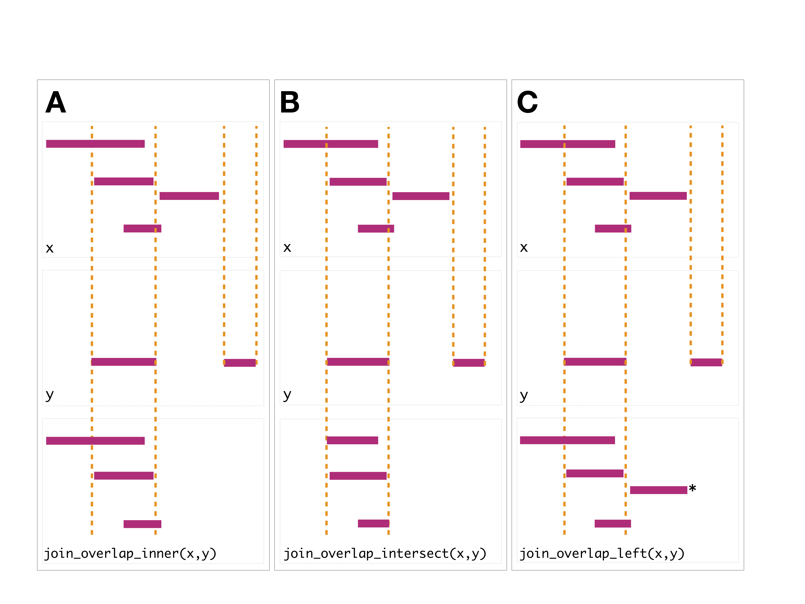
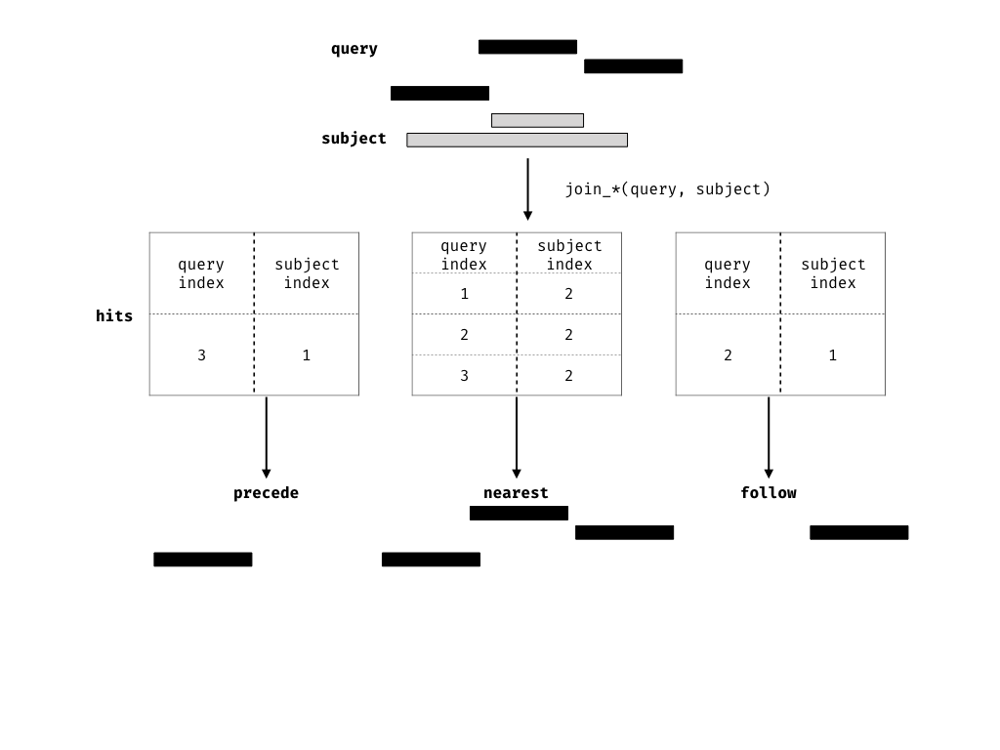

```{r setup, include=FALSE}
options(htmltools.dir.version = FALSE)
```

```{r xaringan-themer, include=FALSE}
library(xaringanthemer)
mono_accent(
  base_color = "#43418A",
  header_font_google = google_font("Josefin Sans"),
  text_font_google   = google_font("Montserrat", "300", "300i"),
  code_font_google   = google_font("Droid Mono")
)
```

# What types of data do we have to deal with?

.pull-left[
# Data Type

+ Sequences (strings)
+ Alignments
+ Genomic ranges (intervals)
+ Genomic variants
+ ‘Rectangular’ data (matrices of numeric values for a set of features and samples)
+ Annotation databases
]
.pull-right[
# Classes

+ [GenomicRanges](https://ww.bioconductor.org/packages/release/bioc/html/GenomicRanges.html)
+ [SummarizedExperiments](http://www.bioconductor.org/packages/release/bioc/html/SummarizedExperiment.html)
+ [MultiAssayExperiments]( http://bioconductor.org/packages/release/bioc/html/MultiAssayExperiment.html)
+ [SingleCellExperiments](http://bioconductor.org/packages/release/bioc/html/SingleCellExperiment.html)
]

---

# Genomic and other 'omic data

```{r, echo = F, fig.align = 'center'}
knitr::include_graphics("img/bioinformatics_file_types.jpg", dpi = NA)
```

---

# Genomic and other 'omic data

```{r, echo = F, fig.align = 'center'}
knitr::include_graphics("img/bioinformatics_file_types_annotated.jpg", dpi = NA)
```


---

# What is Bioconductor?


+ Started in 2001 (initially, mostly focused on microarray data)
+ Currently (release 3.8) hosts:
  + more than 1,600 [software packages](https://www.bioconductor.org/packages/release/BiocViews.html#___Software)
  + almost 1,000 [annotation packages](https://www.bioconductor.org/packages/release/BiocViews.html#___AnnotationData)
  + 360 experiment [data packages](https://www.bioconductor.org/packages/release/BiocViews.html#___ExperimentData)
  + 23 [workflows](https://www.bioconductor.org/packages/release/BiocViews.html#___Workflow)
  
---

# What topics does Bioconductor include?

+ Covers a wide range of domains:
  + sequencing (RNA-seq, ChIP-seq, single-cell analysis, variant calling, …)
  + microarrays (methylation, gene expression, copy number, …)
  + flow and mass cytometry
  + proteomics
  + imaging

--

__Most packages are contributed by the community__

???

There is a core team which, among other things, oversees the project, reviews new package submissions, develops and maintains core infrastructure and maintains daily building and checking of all packages

---

# Biostrings

### Biostrings is a package containing infrastructure for dealing with biological sequences, or strings.

+ These are represented as so called XString objects (or XStringSet objects if you want to include multiple sequences), where X can be DNA, RNA, BB or AA and signifies the type of sequence(s) in the object.

```{r, message = F}
library(Biostrings)
```

--

```{r}
# To create a DNAString object, we can use the DNAString() constructor function. To see how the function works, type ?DNAString.

dna <- DNAString(x = "AGGCATAGA")

head(methods(class = "DNAString"))
    
```

---

# Manipulating Biostrings

```{r, error = TRUE}
# The classes come with useful validity checks. 
# For example, not all characters are allowed in a DNA string.

alphabet(DNAString())
```

--

```{r, error = TRUE}
DNAString(x = "EQI")

```

--

```{r}
alphabet(AAString())
```

--

```{r}
AAString(x = "EQI")

```

---

# Manipulating Biostrings

Once we have defined the object, we can perform operations like

getting the reverse complement of the DNA sequence


```{r}
reverseComplement(dna)
```

--

We could not do this with a regular character string

```{r, error = T}
reverseComplement("AGGCATAGA")
```

---

# Manipulating Biostrings

translating the DNA sequence to an amino acid sequence

```{r}
translate(dna)
```

--

We can not translate an amino acid sequence though

```{r, eval = F}
translate(AAString(x = "EQI"))
```

---

# Sets of Biostrings

If we have more than one sequence, we can represent them in a DNAStringSet object, which is a collection of DNAString objects


```{r}
(dna_multiple <- DNAStringSet(c(x = "AGGCATAGA", y = "GGTATGAG")))
```

--

```{r}
# Subsetting with [] gives back a DNAStringSet
dna_multiple[1]
```

--

```{r}

dna_multiple[[1]]
```

---

# Sets of Biostrings

It is also easy to extract subsequences of either an XString or an XStringSet object

```{r}
# Get the length of each string
width(dna_multiple)
```

--

```{r}

# Extract the first three positions in each string
Biostrings::subseq(dna_multiple, start = 1, end = 3)
```

---

# Sets of Biostrings

```{r}
# Extract subsequences of different length
Biostrings::subseq(dna_multiple, start = 1, end = c(2, 5))
```


```{r}
Biostrings::subseq(dna_multiple, start = 1, end = width(dna_multiple) - 4)
```

---

# Exercise

Genomic sequence information is often stored in fasta files. 

DNAStringSet objects can be created from such files by the readDNAStringSet() function from the Biostrings package. 

We are going to a load a file containing human transcripts from Gencode, then read it into a DNAStringSet object using this function.

```{r}
txs <- Biostrings::readDNAStringSet("data/gencode.v28.transcripts.1.1.10M.fa")
```

---

# Explore a Sequence File

How many sequences are there in this file?


```{r}
length(txs)
```

--

What are the lengths of the shortest and longest sequence?

```{r}
range(width(txs))
```

---

# Explore a Sequence File

Extract the first 10 bases of each sequence

```{r}
Biostrings::subseq(txs, start = 1, end = 10)
```

---

# Explore a Sequence File

Get the fraction of A, C, G and T bases in each sequence (hint: there is a function named alphabetFrequency). Plot a histogram of the fraction of Gs across all sequences

--

```{r}
freqs <- alphabetFrequency(txs)
fracs <- sweep(freqs, MARGIN = 1, STATS = rowSums(freqs), FUN = "/")
#hist(fracs[, "G"])
```

--

What do you think these sequences represent?

---

# Biostring `Ranges`

In Bioconductor there are two classes, `IRanges` and `GRanges`, 
that are standard data structures for representing genomics data. 

--

`Ranges` objects can represent either
1. sets of integers as `IRanges` (which have start, end and width attributes) or 
2. genomic intervals (which have additional attributes, sequence name, and strand) as `GRanges`. 

--

In addition, both types of `Ranges` can store information
about their intervals as metadata columns (for example GC content 
over a genomic interval).

--

`Ranges` objects follow the tidy data principle: 
+ each row of a `Ranges` object corresponds to an interval
+ each column represents a variable about that interval
+ each object will represent a single unit of observation (like gene annotations). 

--

Consequently, `Ranges` objects provide a powerful representation for reasoning about genomic data. 

???

In this vignette, you will learn more about `Ranges` objects and how via grouping, restriction and summarisation you can perform common data tasks. 

---

# GenomicRanges

The GenomicRanges package holds infrastructure for working with (genomic) ranges

```{r}
library(GenomicRanges)
```

--

These can represent: gene coordinates, ChIP-seq peaks, promoters, SNPs, CpG islands, etc.

--

A GRanges (genomic ranges) object contains, for each range, information about
  1. the chromosome (called sequence)
  1. the interval (start and end)
  1. the strand (either +, - or *)
  
---

# The plyranges package

Plyranges is a package for manipulating genomic data according to 'tidy' data principles. 

It uses intuitive 'verbs' to help clarify your code and obeys a few rules established by the __dplyr__ package and the __tidyverse__ family of R packages.  

--

+ Each variable forms a column.
+ Each observation forms a row.
+ Each type of observational unit forms a table.

---


# Constructing `Ranges`

To construct an `IRanges` there must be at least two columns that represent either:
+ a starting coordinate
+ finishing coordinate or 
+ the width of the interval. 

--

```{r}
suppressPackageStartupMessages(library(plyranges))

df <- data.frame(start=c(2:-1, 13:15), 
                 width=c(0:3, 2:0))

# produces IRanges
rng <- df %>% as_iranges()
rng

```

---

# Construting Granges

To construct a `GRanges` we require an additional column that represents:
+ that sequence name (contig or chromosome id), and 
+ an optional column to represent the strandedness of an interval. 

--

```{r}
# seqname is required for GRanges, metadata is automatically kept
grng <- df %>% 
  transform(seqnames = sample(c("chr1", "chr2"), 7, replace = TRUE),
         strand = sample(c("+", "-"), 7, replace = TRUE),
         gc = runif(7)) %>% 
  as_granges()

grng
```

---

# Arithmetic on Ranges

You can modify a genomic interval by altering the width of the interval while leaving the start, end or midpoint of the coordinates unaltered. 

This is achieved with the `mutate` verb along with `anchor_*` adverbs. 

--

The act of anchoring fixes either the start, end, center coordinates of the 
`Range` object. 

Anchors are used in combination with either `mutate` or `stretch`.

```{r, echo = FALSE, out.width="400px", fig.align="center"}
knitr::include_graphics("img/anchors.png", dpi = 150)
```

---

# Arithmetic on Ranges

```{r}
rng <- as_iranges(data.frame(start=c(1, 2, 3), end=c(5, 2, 8)))
grng <- as_granges(data.frame(start=c(1, 2, 3), end=c(5, 2, 8), 
                          seqnames = "seq1",
                          strand = c("+", "*", "-")))
```


```{r}
mutate(rng, width = 10)
```


```{r}
mutate(anchor_start(rng), width = 10)
```


```{r}
mutate(anchor_end(rng), width = 10)
```


```{r}
mutate(anchor_center(rng), width = 10)
```


```{r}
mutate(anchor_3p(grng), width = 10) # leave negative strand fixed
```


```{r}
mutate(anchor_5p(grng), width = 10) # leave positive strand fixed
```

---

# Arithmetic on Ranges

You can also modify the width of an interval using the `stretch` verb.


Without anchoring, this function will extend the interval in either direction by an integer amount. 

With anchoring, either the start, end or midpoint are preserved. 

```{r}
rng2 <- stretch(anchor_center(rng), 10)
rng2
```


```{r}
stretch(anchor_end(rng2), 10)
```


```{r}
stretch(anchor_start(rng2), 10)
```


```{r}
stretch(anchor_3p(grng), 10)
```


```{r}
stretch(anchor_5p(grng), 10)
```

---

# Arithmetic on Ranges

`Ranges` can be shifted left or right. If strand information is available 
we can also shift upstream or downstream. 

```{r}
shift_left(rng, 10)
```


```{r}
shift_right(rng, 10)
```


```{r}
shift_upstream(grng, 10)
```


```{r}
shift_downstream(grng, 10)
```

---

# Grouping `Ranges`

Grouping can act on either the core components or the metadata columns of
a `Ranges` object.

It is most effective when combined with other verbs such as `mutate()`,
`summarise()`, `filter()`, `reduce_ranges()` or `disjoin_ranges()`.

--

```{r}
grng <- data.frame(seqnames = sample(c("chr1", "chr2"), 7, replace = TRUE),
         strand = sample(c("+", "-"), 7, replace = TRUE),
         gc = runif(7),
         start = 1:7,
         width = 10) %>%
  as_granges()
```

---

# Restricting `Ranges`

The verb `filter` can be used to restrict rows in the `Ranges`.
Note that grouping will cause the `filter` to act within each group 
of the data.

```{r}
grng %>% filter(gc < 0.3)
```

---

# Restricting `Ranges`

```{r}
grng_by_strand <- grng %>%
  group_by(strand)

# filtering by group 
grng_by_strand %>% filter(gc == max(gc)) 
```

---

# Grouping `Ranges`

We also provide the convenience methods `filter_by_overlaps` and 
`filter_by_non_overlaps` for restricting by any overlapping `Ranges`.

```{r}
ir0 <- data.frame(start = c(5,10, 15,20), width = 5) %>%
  as_iranges()
ir1 <- data.frame(start = 2:6, width = 3:7) %>%
  as_iranges()
```

--

```{r}
ir0
```

---

# Grouping `Ranges`

```{r}
ir1
```

---

# Grouping `Ranges`

```{r}
ir0 %>% filter_by_overlaps(ir1)
```

---

# Grouping `Ranges`

```{r}
ir0 %>% filter_by_non_overlaps(ir1) 
```

---

# Summarising `Ranges`

The `summarise` function will return a `DataFrame` because the information required to return a `Ranges` object is lost. It is often most useful to use `summarise()` in combination with the `group_by()` family of functions. 

```{r}
ir1 <- ir1 %>%
  mutate(gc = runif(length(.)))
```


```{r}
ir0 %>% 
  group_by_overlaps(ir1) %>%
  summarise(gc = mean(gc))
```

---

# Joins: finding overlaps between `Ranges`

A join acts on two GRanges objects, a query and a subject.

```{r}
query <- data.frame(seqnames = "chr1",
               strand = c("+", "-"),
               start = c(1, 9), 
               end =  c(7, 10),
               key.a = letters[1:2]) %>% 
  as_granges()
```


```{r}
subject <- data.frame(seqnames = "chr1",
               strand = c("-", "+"),
               start = c(2, 6), 
               end = c(4, 8),
               key.b = LETTERS[1:2]) %>% 
  as_granges()
```

---

# Joins: finding overlaps between `Ranges`

```{r, echo = FALSE, fig.cap = "Query and Subject Ranges", message = FALSE}
library(ggplot2)
query_df <- as.data.frame(query)[, -6]
query_df$key <- "Query"
subject_df <- as.data.frame(subject)[, -6]
subject_df$key <- "Subject"
melted_ranges <- rbind(query_df, subject_df)
ggplot(melted_ranges, aes(xmin = start, xmax = end, ymin = 1, ymax = 3)) +
  geom_rect() + 
  facet_grid(key ~ .) +
  scale_x_continuous(breaks = seq(1, 10, by = 1)) +
  xlab("Position") +
  theme(axis.text.y = element_blank(),
        axis.ticks.y = element_blank(),
        axis.title.y = element_blank())
```

---

# Joining Ranges

All joining methods in `plyranges` result in a set of sequences based on overlap or proximity of ranges and use those hits to merge the two 
datasets in different ways.

--

There are four methods:

+ _overlap_
+ _nearest_ 
+ _precede_
+ _follow_ 

---

# Joining Ranges

We can further restrict the matching by whether the query is completely _within_ the subject, and adding the _directed_ suffix ensures that matching ranges have the same direction (strand).

--

```{r echo = FALSE, out.width="600px"}

```

---

`# Intersecting Ranges`

`join_overlap_intersect()` will return a `Ranges` object where the start, end, and width coordinates correspond to the amount of any overlap between the left and right input `Ranges`. 

It also returns any metadatain the subject range if the subject overlaps the query.

```{r}
intersect_rng <- join_overlap_intersect(query, subject)
intersect_rng
```

---

# Intersecting Ranges

```{r echo = FALSE, fig.cap="Intersect Join"}
intersect_df <- as.data.frame(intersect_rng)[, -c(6,7)]
intersect_df$key <- "Intersect Join"
melted_ranges <- rbind(query_df, subject_df, intersect_df)
melted_ranges$key <- factor(melted_ranges$key, 
                              levels = c("Query", "Subject", "Intersect Join"))
ggplot(melted_ranges, aes(xmin = start, xmax = end, ymin = 1, ymax = 3)) +
  geom_rect() + 
  facet_grid(key ~ .) +
  scale_x_continuous(breaks = seq(1, 10, by = 1)) +
  xlab("Position") +
  theme(axis.text.y = element_blank(),
        axis.ticks.y = element_blank(),
        axis.title.y = element_blank())
```

---

# Overlapping Ranges

The `join_overlap_inner()` function will return the `Ranges` in the query that overlap any `Ranges` in the subject. Like the `join_overlap_intersect()` function metadata of the subject `Range` is returned if it overlaps the query. 

```{r}
inner_rng <- join_overlap_inner(query, subject)
inner_rng
```

---

# Overlapping Ranges

```{r, echo = FALSE, fig.cap = "Inner Join", message = FALSE}
inner_df <- as.data.frame(inner_rng)[, -c(6,7)]
inner_df$ymin <- c(1,4)
inner_df$ymax <- c(3,6)
inner_df$key <- "Inner Join"
melted_ranges <- rbind(query_df, subject_df)
melted_ranges$ymin <- 1
melted_ranges$ymax <- 3
melted_ranges <- rbind(melted_ranges, inner_df)
melted_ranges$key <- factor(melted_ranges$key, 
                              levels = c("Query", "Subject", "Inner Join"))

ggplot(melted_ranges, aes(xmin = start, xmax = end, ymin = ymin, ymax = ymax)) +
  geom_rect() + 
  facet_grid(key ~ ., scales = "free_y") +
  scale_x_continuous(breaks = seq(1, 10, by = 1)) +
  xlab("Position") +
  theme(axis.text.y = element_blank(),
        axis.ticks.y = element_blank(),
        axis.title.y = element_blank())
```

--

We also provide a convenience method called `find_overlaps` that computes the same result as `join_overlap_inner()`.

```{r}
find_overlaps(query, subject)
```

---

# Finding Neighboring Ranges

Plyranges also has methods for finding nearest, preceding or following `Ranges`. This is similar in concept to finding overlaps
--

```{r echo = FALSE, out.width="600px"}

```

---

# Finding Neighboring Ranges

```{r}
join_nearest(ir0, ir1)
```

---

# Finding Neighboring Ranges

```{r}
join_follow(ir0, ir1)
```

---

# Finding Neighboring Ranges

```{r}
join_precede(ir0, ir1) # nothing precedes returns empty `Ranges`
```

---

# Finding Neighboring Ranges

```{r}
join_precede(ir1, ir0)
```

---

# Example: dealing with multi-mapping
This example is taken from the Bioconductor support [site](https://support.bioconductor.org/p/100046/).

--

We have two `Ranges` objects. The first contains single nucleotide positions
corresponding to an intensity measurement such as a ChiP-seq experiment, 
while the other contains coordinates for two genes of interest.

--


We want to identify which positions in the `intensities` `Ranges` overlap the genes, where each row corresponds to a position that overlaps a single gene.

---

# Example: dealing with multi-mapping

First we create the two `Ranges` objects

--

```{r}
intensities <- data.frame(seqnames = "VI",
                          start = c(3320:3321,3330:3331,3341:3342),
                          width = 1) %>% 
  as_granges()

intensities
```

---

# Example: dealing with multi-mapping

```{r}
genes <- data.frame(seqnames = "VI", 
                    start = c(3322, 3030),
                    end = c(3846, 3338),
                    gene_id=c("YFL064C", "YFL065C")) %>% 
  as_granges()
                    
genes
```

---

# Example: dealing with multi-mapping

Now to find where the positions overlap each gene, we can perform an overlap
join. This will automatically carry over the gene_id information as well as
their coordinates (we can drop those by only selecting the gene_id). 

--

```{r}
olap <- join_overlap_inner(intensities, genes) %>%
  select(gene_id)
olap
```

---

# Example: dealing with multi-mapping

Several positions match to both genes. We can count them using `summarise`
and grouping by the `start` position:

--

```{r}
olap %>% 
  group_by(start) %>%
  summarise(n = n())
```

---

# Grouping by overlaps

It's also possible to group by overlaps. Using this approach we can count the number of overlaps that are greater than 0. 

--

```{r}
grp_by_olap <- ir0 %>% 
  group_by_overlaps(ir1)
grp_by_olap
```

---

# Grouping by overlaps

```{r}
grp_by_olap %>%
  mutate(n_overlaps = n())
```

--

Of course we can also add overlap counts via the `count_overlaps()` function.

```{r}
ir0 %>%
  mutate(n_overlaps = count_overlaps(., ir1))
```

---

# Data Import/Output

Plyranges has convenience functions for reading/writing the following data formats to/from `Ranges` objects.

| `plyranges` functions | File Format |
|-----------------------|-------------|
|   `read_bam()`        | BAM         |
| `read_bed()`/`write_bed()` | BED    |
| `read_bedgraph()`/ `write_bedgraph()` | BEDGraph |
| `read_narrowpeaks()`/ `write_narrowpeaks()` | narrowPeaks |
| `read_gff()` / `write_gff()` | GFF(1-3) / GTF |
| `read_bigwig()` / `write_bigwig()` |  BigWig |
| `read_wig()` / `write_wig()` | Wig |

---

# Learning more

- The [Bioc 2018 Workshop book](https://bioconductor.github.io/BiocWorkshops/fluent-genomic-data-analysis-with-plyranges.html) has worked examples of using `plyranges` to analyse
publicly available genomics data.
- The [extended vignette in the plyrangesWorkshops package](https://github.com/sa-lee/plyrangesWorkshops) has a detailed
walk through of using plyranges for coverage analysis.
- The [case study](https://github.com/mikelove/plyrangesTximetaCaseStudy) by Michael Love using plyranges with [tximeta](https://bioconductor.org/packages/release/bioc/html/tximeta.html) to follow
up on interesting hits from a combined RNA-seq and ATAC-seq analysis. 
- The [journal article](https://genomebiology.biomedcentral.com/articles/10.1186/s13059-018-1597-8) ([preprint here](https://www.biorxiv.org/content/early/2018/05/23/327841)) has
details about the overall philosophy and design of plyranges.

---

# Exercise

In practice, the locations of known genomic features (exons, genes, transcripts, UTRs, …) along the genome are often stored in so called gtf (gene transfer format) files. 

--

These files can be imported into a GRanges object using the import() function from the rtracklayer Bioconductor package.

--

We will load in a gtf file from gencode and read it into R in this way.

--


```{r}
gtf <- rtracklayer::import("data/gencode.v28.annotation.1.1.10M.gtf")
```

---

Confirm that the gtf object is indeed a GRanges object

--


```{r}
class(gtf)
```

---

How many records are there in the object?

--


```{r}
length(gtf)
```

---

From which chromosomes do the records come?

--

```{r}
seqlevels(gtf)
```

---

Use the subset function to extract only the records for the CHD5 gene. How many annotated transcripts does this gene have?

--

```{r}
gtfsub <- subset(gtf, gene_name == "CHD5")
length(subset(gtfsub, type == "transcript"))
```

---


# SummarizedExperiment

The purpose of the SummarizedExperiment class (provided in the package with the same name) is to hold ‘rectangular’ data, together with annotations and metadata for the rows and columns. In other words, all the data associated with an experiment!

--

This class (or extensions) is widely used throughout the Bioconductor ecosystem, e.g., for representing RNA-seq, ChIP-seq, methylation and mass cytometry data.

--

The SummarizedExperiment object consists of three types of ‘tables’, denoted assays (actually a list of matrices of the same size, containing 
1. the observed data, e.g., gene expression values
1. rowData (annotations for the rows, i.e., the features). This can be replaced by rowRanges (a GRanges object) that can also hold genomic range information, e.g., the locations of genes
1. colData (annotations for the columns, i.e., the samples)

---

# SummarizedExperiment

```{r}
library(SummarizedExperiment)

se <- SummarizedExperiment(
assays = list(exprs = matrix(10 * runif(15), 5, 3)),
colData = DataFrame(sample = 1:3, condition = c("A", "A", "B")),
rowData = DataFrame(gene = paste0("G", 1:5))
)
rownames(se) <- rowData(se)$gene
colnames(se) <- colData(se)$sample
se

```

---

# SummarizedExperiment

The SummarizedExperiment class has accessor functions to extract the individual components.

--

```{r}
assayNames(se)

    

    assay(se, "exprs")

    colData(se)

    rowData(se)

```

---

# SummarizedExperiment

--

There are also convenient subsetting functions. Note how all the relevant parts of the objects are subset!

--

```{r}
(sesub <- se[1:2, ])

    assay(sesub, "exprs")


    colData(sesub)

    rowData(sesub)

```

---

# SummarizedExperiment

--

If a GRanges object is used to represent the row annotations, the mcols() slot of the GRanges object is returned by rowData(se).

--


```{r}
(se <- SummarizedExperiment(
    assays = list(exprs = matrix(10 * runif(15), 5, 3)),
    colData = DataFrame(sample = 1:3, condition = c("A", "A", "B")),
    rowRanges = GRanges(seqnames = "chr1",
                        ranges = IRanges(start = 100 * runif(5),
                                         width = 50),
                        strand = "+",
                        gene = paste0("G", 1:5))
    ))

    class(se)

    rowData(se) 

    rowRanges(se)

```

---

# Exercise

--

Here we will explore a real RNA-seq data set, which is provided in the airway Bioconductor package and stored in a RangedSummarizedExperiment object. First load the package and attach the data set.

--

```{r}
library(airway)
data(airway)
airway
```

---

# Exercise

What type of data value are available in this object? How many samples are there? How many features?

--

```{r}
assayNames(airway)
dim(airway)
```

---

# Exercise

What is the total number of sequencing reads assigned to genes for each sample?

--

```{r}
colSums(assay(airway, "counts"))
```

---

# public data resources and bioconductor

[GEOquery](https://bioconductor.org/packages/release/bioc/html/GEOquery.html): Access to the NCBI Gene Expression Omnibus (GEO), a public repository of gene expression (primarily microarray) data.

[GenomicDataCommons](https://bioconductor.org/packages/release/bioc/html/GenomicDataCommons.html): Access to the NIH / NCI Genomic Data Commons RESTful service.

[curatedTCGAData](https://www.bioconductor.org/packages/release/data/experiment/html/curatedTCGAData.html): Curated data from The Cancer Genome Atlas (TCGA) as MultiAssayExperiment Objects

[curatedMetagenomicData](https://www.bioconductor.org/packages/release/data/experiment/html/curatedMetagenomicData.html): Curated metagenomic data of the human microbiome

[HMP16SData](https://bioconductor.org/packages/release/data/experiment/html/HMP16SData.html): Curated metagenomic data of the human microbiome

[PharmacoGx](https://www.bioconductor.org/packages/release/bioc/html/PharmacoGx.html): Curated large-scale preclinical pharmacogenomic data and basic analysis tools

[OmicIDXR](https://seandavi.github.io/OmicIDXR/)

---

# Further reading

An overview of the Bioconductor project and its capabilities is given in Huber et al.: Orchestrating high-throughput genomic analysis with Bioconductor. Nature Methods 12:115–121 (2015).

An introduction to the analysis of ranges in Bioconductor (particularly useful if you have experience with bedtools) is provided in the HelloRanges package

Bioconductor provides a long list of material from previous courses, some videos and links to upcoming events

---

# References 

1. https://cran.r-project.org/web/packages/qwraps2/vignettes/create_pkg.html
2. http://r-pkgs.had.co.nz/
3. https://www.bioconductor.org/developers/package-guidelines/#unittest
4. https://bioconductor.org/developers/how-to/version-numbering/
5. https://www.bioconductor.org/help/package-vignettes/
6. https://bioconductor.org/packages/release/bioc/vignettes/BiocStyle/inst/doc/LatexStyle2.pdf

---


