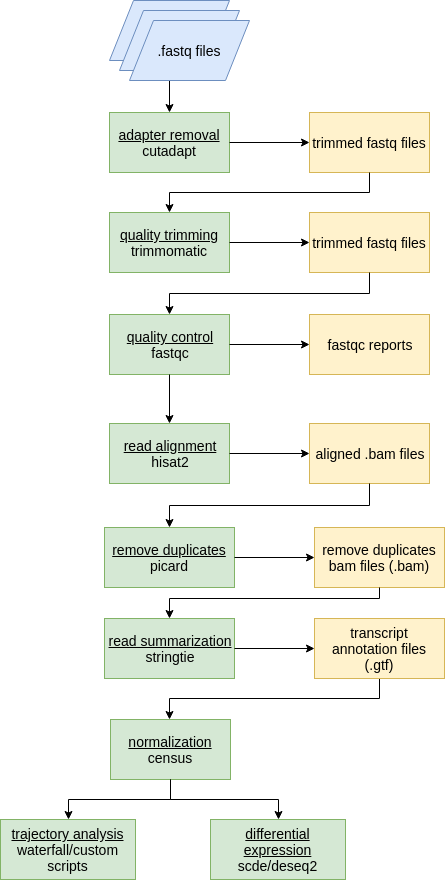
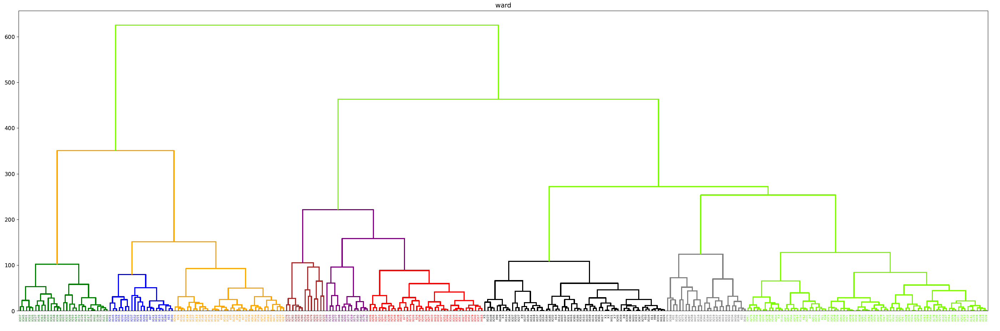
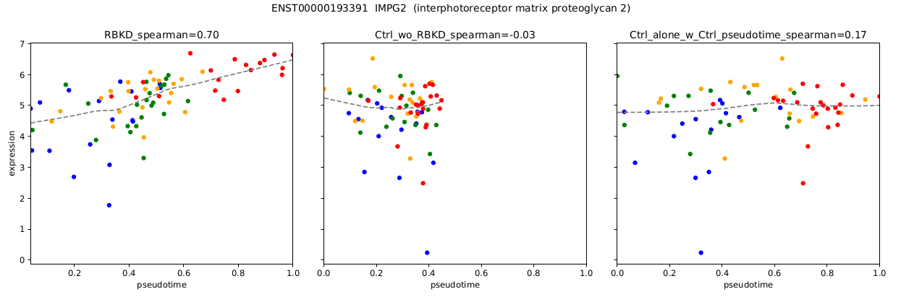
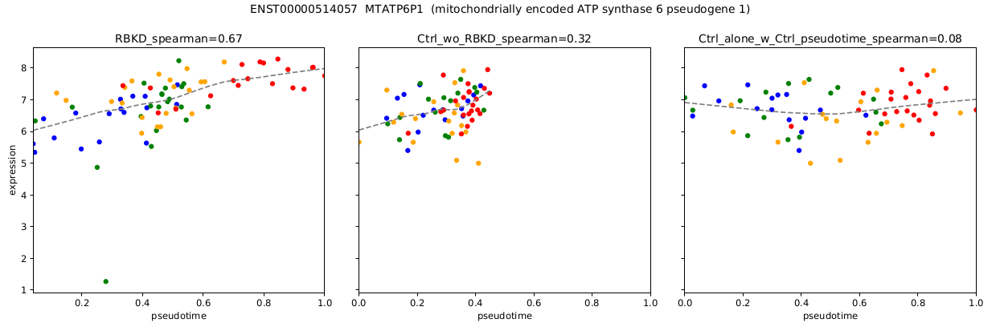
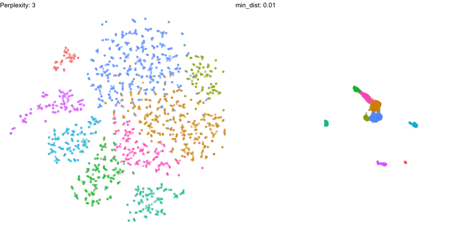
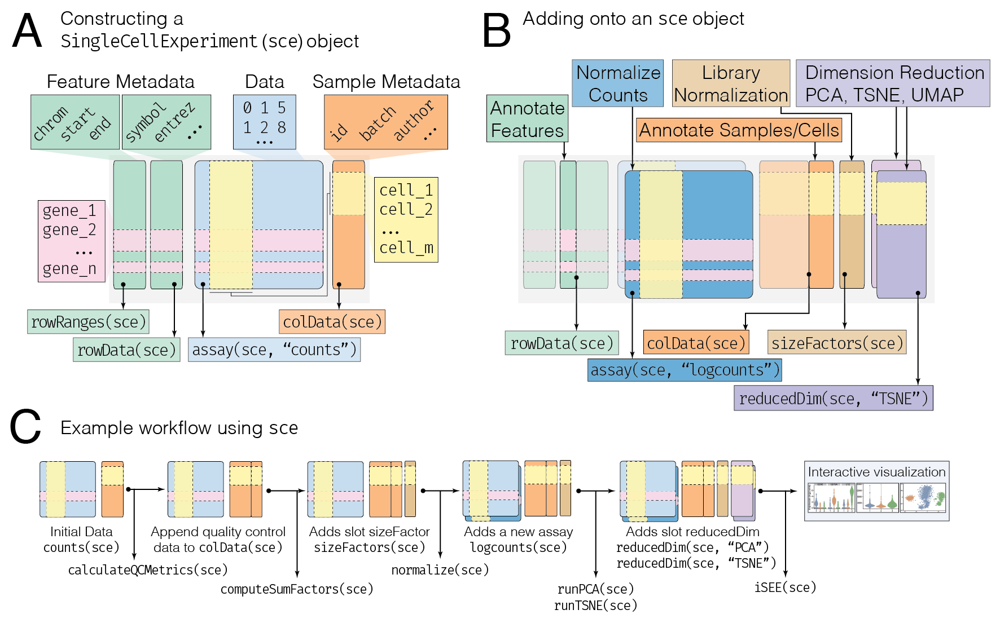

```{r setup, include=FALSE}
options(htmltools.dir.version = FALSE)
knitr::opts_chunk$set(echo = F, warning = F, message = F)

```

```{r xaringan-themer, include = FALSE}
library(xaringanthemer)
mono_accent(
  base_color = "#43418A",
  header_font_google = google_font("Josefin Sans"),
  text_font_google   = google_font("Montserrat", "300", "300i"),
  code_font_google   = google_font("Droid Mono")
)

library(RefManageR)

BibOptions(
  check.entries = FALSE, 
  bib.style = "authoryear", 
  cite.style = "authoryear", 
  style = "markdown",
  hyperlink = FALSE, 
  dashed = FALSE)
myBib = ReadBib("20190412_lab_meeting.bib")
```

```{r}
library(printr)
```

### Learning Resources (links)

[Hemberg Lab RNAseq course](https://hemberg-lab.github.io/scRNA.seq.course/index.html)

[Seurat Vignettes](https://satijalab.org/seurat/get_started.html)

[Introduction to Bioconductor](http://osca.bioconductor.org/introduction.html)

---

### Imagine (fantasize) that you have single cell data

```{r, out.height = 400, fig.align='center'}

knitr::include_graphics("img/exponential_scaling_scrnaseq.png", dpi = NA)

```

`r pander::pander(RefManageR::Citet(myBib, "svenssonExponentialScalingSinglecell2018"))`

---

### How can you ask biological questions about it?

```{r, out.height = 400, fig.align='center'}

knitr::include_graphics("img/pipeline_diagram.png", dpi = NA)

```

--

#### What do you (and your labmates) do next?

---

### How I manage single cell data in the lab

+ Use [rstudio-server](https://www.rstudio.com/products/rstudio/download-server/) via the web browser

--

+ ssh connect in a terminal

--

+ Use [JupyterLab](https://jupyterlab.readthedocs.io/en/stable/getting_started/overview.html) in the browser (python)

--

+ Use a graphical user interface (gui) that manages an sftp connection:

1. Cyberduck (Mac) 
2. filezilla (Mac/Windows)
3. PuTTY (Windows)

--

+ Use 'Shiny' Web Apps

---

### A Naive Approach

--

### Analysis Pipeline

```{r scRNA_analysis, out.height=450, out.width=300}

```

---

### Plot hierarchical clustering
```{r hierarch, echo=FALSE,out.width=900,fig.align='center'}

```

---

### Calculate Principle Components

<style>
    #wrap { width: 900px; height: 1000px; padding: 0; overflow: hidden; }
    #frame { width: 800px; height: 700px; border: 0px solid black; }
    #frame {
        -ms-zoom: 0.75;
        -moz-transform: scale(0.75);
        -moz-transform-origin: 0 0;
        -o-transform: scale(0.75);
        -o-transform-origin: 0 0;
        -webkit-transform: scale(0.75);
        -webkit-transform-origin: 0 0;
    }
</style>

<div id="wrap">
<iframe id="frame" frameborder="0" scrolling="no" src="img/Plot_1.html"></iframe>
</div>
---

### Plot Trajectory

<iframe width="900" height="750" frameborder="0" scrolling="no" src="img/shRB_cluster_colors2.html"></iframe>

---

### Calculate Pseudotime

<iframe width="900" height="750" frameborder="0" scrolling="no" src="img/PT_shRB_shCtrl2.html"></iframe>

---

### Find Genes Correlated with Pseudotime

```{r corr_genes, echo=FALSE,out.width="900px"}



```

---

### Why did this not work well?

--

+ Normalization 

--

+ Batch Effects

--

+ Incomplete Dimensional Reduction

--

+ Naive Clustering Approach

---

###  The Next Generation: Seurat

#### What is Seurat?

Seurat is an R package designed for QC, analysis, and exploration of single-cell RNA-seq data. 

  Written in R so fits easily into existing analysis

---

### What are the major parts of Seurat?

--

### Dimensional Reduction by PCA

```{r, out.height=400}
knitr::include_graphics("img/pca.gif", dpi = NA)

```

---

### Graph Construction and Clustering

```{r, out.height = 400, fig.align='center'}
knitr::include_graphics("img/phenograph.jpg", dpi = NA)

```

---

### Further Dimensional Reduction

#### Several Techniques: most common is tSNE or UMAP

```{r, out.width = 960, out.height = 480}


```

---

### Seurat

Advantages:

1. Batch Correction aka 'integration'.  

2. Label Transfer across experiments  

3. Normalization 

---

### Batch Correction aka integration.  

Seurat v3 implements methods to identify ‘anchors’ across diverse single-cell data types to construct harmonized references, or to transfer information across experiments.
`r pander::pander(RefManageR::Citet(myBib, "stuartComprehensiveIntegrationSingle2018"))`

```{r, out.width = 900}
knitr::include_graphics("img/stuart_integration_diagram.png", dpi = NA)

```

---

### Label Transfer across experiments  

We can use the same batch correction technique to predict the cluster that a cell from a 'query' dataset would fall into in a reference dataset.

Useful for comparison to published studies 

---

### Normalization 

Seurat v3 includes sctransform, a new modeling approach for the normalization of single-cell data. Compared to standard log-normalization, sctransform effectively removes technically-driven variation while preserving biological heterogeneity.

`r pander::pander(RefManageR::Citet(myBib, "hafemeisterNormalizationVarianceStabilization2019"))`

---

### Some other Approaches to Single Cell Transcriptome Analysis 

1. [Scanpy](https://scanpy.readthedocs.io/en/latest/)

2. [Bioconductor](https://osca.bioconductor.org/)
  + includes a lot more than just scRNAseq 

---

### [Scanpy](https://scanpy.readthedocs.io/en/latest/) Strengths and Weaknesses

1. Speed

2. Pseudotime Integration - PAGA

3. Makes several machine learning approaches easier to use

  + Denoising Auto Encoder
  
  `r pander::pander(RefManageR::Citet(myBib, "eraslanSinglecellRNAseqDenoising2019"))`

  + Integrating Datasets (Batch Correction) using Machine Learning 
  
  `r pander::pander(RefManageR::Citet(myBib, "lotfollahiGenerativeModelingLatent2018a"))`
  
  + Transfer Learning
  
  `r RefManageR::Citet(myBib, "lotfollahiGenerativeModelingLatent2018a")`
  
---

### [Bioconductor](https://osca.bioconductor.org/)

Bioconductor is a repository of R packages which focuses on software tailored for genomic analysis.

(Think of it as CRAN for bioinformatics)

Bioconductor has strict requirements for a package to be accepted into the repository. 

there is also a focus on high quality documentation and the use of common data infrastructure to promote package interoperability.

---

### Seurat works well! Why Bioconductor?

1. Seurat is written and designed with similar principles to bioconductor. We can better understand Seurat if we get a good grasp of bioconductor. 

--

2. We can extend our analysis to other domains (genomics/epigenomics) with a solid understanding of bioconductor. 

--

3. We can interact with public data and annotation:
  + Gene Expression Omnibus (GEO)
  + Sequence Read Archive (SRA)
  + Annotation-- Refseq, ensembl, gencode

---

### Installing Bioconductor Packages

To install Bioconductor packages, we first need the BiocManager package which is hosted on CRAN. This can be installed by running:

```{r, eval = F}
install.packages("BiocManager")
```

The BiocManager package makes it easy to install packages from the Bioconductor repository. For example, to install the SingleCellExperiment package, we run:

```{r, eval = F}
## the command below is a one-line shortcut for:
## library(BiocManager)
## install("SingleCellExperiment")
BiocManager::install("SingleCellExperiment")
```

---

###  Digression: Getting Help

Reminder: one of the most important R skills is knowing how to get help. The most reliable place to look is inside R!

--

To get the manual associated with a function, class, dataset, or package, you can prepend the code of interest with a ? to retrieve the relevant help page. 

For example, to get information about the data.frame() function, the SingleCellExperiment class, the in-built iris dataset, or for the BiocManager package, you can type:

```{r, echo = T, eval = F}
?data.frame
?SingleCellExperiment
?iris
?BiocManager
```

---

### the `SingleCellExperiment` object

The motivation: 

RNA sequencing data consists of three major parts: 

1. The expression data (counts)
  + usually expressed in a matrix of features (genes or transcripts) by row and cells by column.

--

2. The cell-level information (colData)

--

3. The feature-level information (featureData)

--

__It can be a pain to keep track of this in many separate objects__

So we use a specialized object from the Bioconductor ecosystem, the `SingleCellExperiment`

---

### Single Cell Experiment



---

### So many tools!


<blockquote class="twitter-tweet" data-lang="en"><p lang="en" dir="ltr">Too many awesome new datasets, biological findings, ML methods every second of every day. And they are spawning too many new ideas. I luv science &amp; I&#39;m going crazy (in a good way) that I can&#39;t keep up with all the coolness and just have one brain and two hands and no time. Fk!!!!</p>&mdash; ANSHUL KUNDAJE (@anshulkundaje) <a href="https://twitter.com/anshulkundaje/status/1116398619072942080?ref_src=twsrc%5Etfw">April 11, 2019</a></blockquote>
<script async src="https://platform.twitter.com/widgets.js" charset="utf-8"></script>

--

### What's the most efficient way to pursue your (biological) questions?

---

### Step 1: Data Science for all


.pull-left[

<span style="font-size: 200%">[R for Data Science](https://r4ds.had.co.nz/)</span>

<span style="font-size: 200%">[rstudio cheat sheets](https://www.rstudio.com/resources/cheatsheets/)</span>
]

.pull-right[

```{r}
knitr::include_graphics("img/r4ds.png", dpi = NA)

```

]

---

### Step 2: Graphical User Interfaces(GUIs) for some

#### scRNA Visualization Tools

1. [scClustViz](https://baderlab.github.io/scClustViz/)

2. [iSEE](https://bioconductor.org/packages/release/bioc/html/iSEE.html)

---

### scClustViz

[Developmental Emergence of Adult Neural Stem Cells as Revealed by Single-Cell Transcriptional Profiling](https://innesbt.shinyapps.io/scclustvizdemoapp/)

---

### iSEE

1. [a small single-cell RNA-seq dataset from the mouse visual cortex](https://marionilab.cruk.cam.ac.uk/iSEE_allen/)
2. [The Cancer Genome Atlas RNA-seq dataset](https://marionilab.cruk.cam.ac.uk/iSEE_tcga/)
3. [a droplet-based single-cell RNA-seq dataset involving peripheral blood mononuclear cells](https://marionilab.cruk.cam.ac.uk/iSEE_pbmc4k/)
4. [a mass cytometry dataset from healthy and diseased human donors](https://marionilab.cruk.cam.ac.uk/iSEE_cytof/)

---

### Or make your own with Shiny and Plotly!

Seurat outputs ggplot objects from all its plotting functions

The `plotly` R package can turn these into interactive `plotly` plots

Shiny is an R package that makes it easy to build interactive web apps straight from R. You can then display these plots in your own custom shiny app

---

### References

```{r, results = 'asis'}
# pander::pander(purrr::possibly(RefManageR::PrintBibliography(myBib)))
RefManageR::PrintBibliography(myBib, start = 1, end = 4)
```

